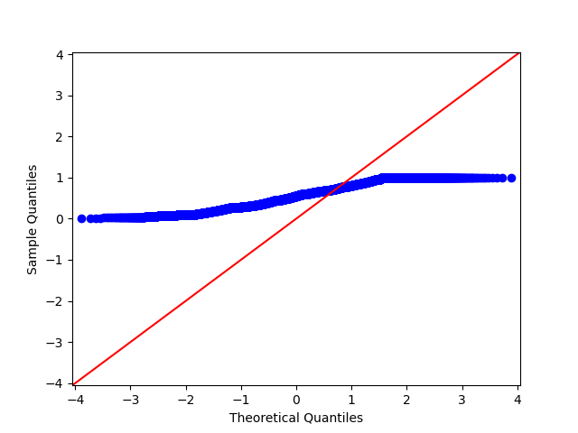
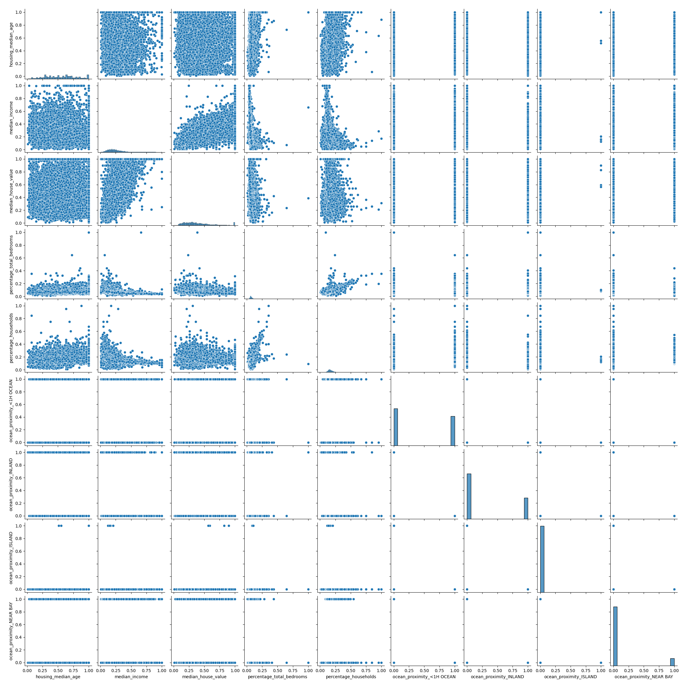
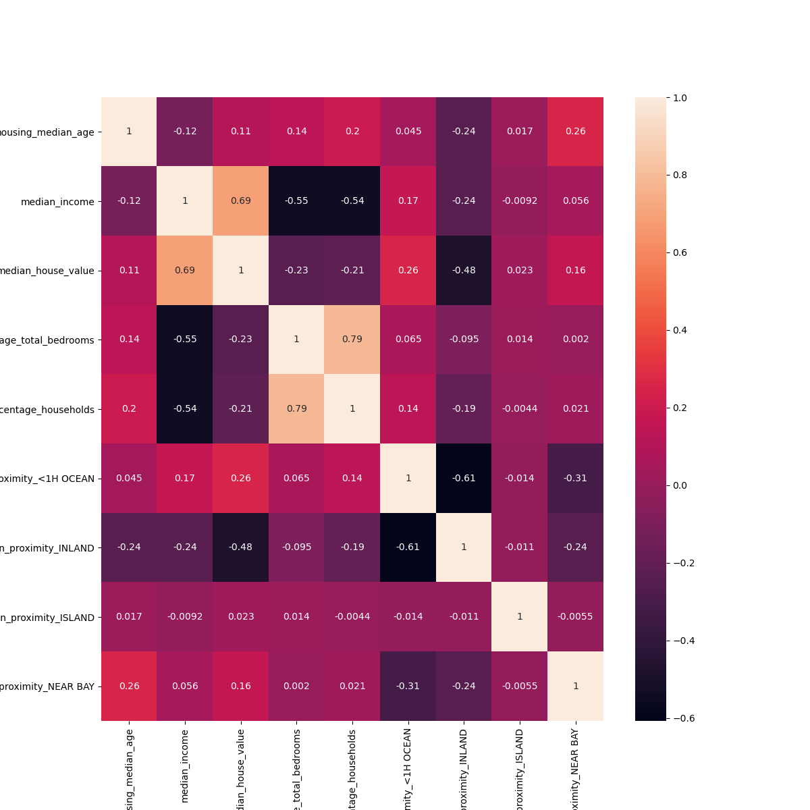

# Housing price prediction

In this project, I will build an ML model to predict the price of a house. The target of the project is the median house value, which does not require further transformation. In the coming sessions, the insights/findings, results, and error measurements of the linear model will be presented. Last, the quality and reliability of the results will be discussed. Conclusion/recommendations and future improvement will be talked about in the end.

## Data Processing

For this project, dataset appeared in a 1997 paper titled Sparse Spatial Autoregressions by Pace, R. Kelley and Ronald Barry, published in the Statistics and Probability Letters journal. They built it using the 1990 California census data. It contains one row per census block group. A block group is the smallest geographical unit for which the U.S. Census Bureau publishes sample data.

1. longitude: A measure of how far west a house is; a higher value is farther west(dropped)
2. latitude: A measure of how far north a house is; a higher value is farther north (dropped)
3. housing Median Age: Median age of a house within a block; a lower number is a newer building
4. total Rooms: Total number of rooms within a block
5. total Bedrooms: Total number of bedrooms within a block
6. population: Total number of people residing within a block
7. households: Total number of households, a group of people residing within a home unit, for a block
8. median Income: Median income for households within a block of houses measured in tens of thousands of US Dollars
9. median House Value: Median house value for households within a block measured in US Dollars (target)
10. ocean Proximity: Location of the house w.r.t ocean/sea (one-hot encoding)

Moreover, there were some values that were anomalous. Some columns contain zero values, which didn’t make sense. I simply dropped those zero-number rows. In addition, I created additional variables to avoid colinearity issues such as bedroom over the total room, the number of rooms per household, and household over the population to improve model performance. Also, I one-hot-encode categorical features to boolean features and check if a certain group is significant.

## EDA (in assumption)
First, I looked up the all numeric features' distribution and plot Q-Q plot to check whether it is normlity, one of the results as below chart shown. 

The distribution plot shows that it is skewed left. The Q-Q plot shows that it may close to a uniform distribution.

xy relationship chart shows that median_income, bedroom over the total room, and household over the population have linear relatonship to the target.

The answer is clearly explained by the chart. population vs household and total_bedroom vs total_room have the closest explanation power to the target.

## Models and Results

In this section, I’ve tried just the simplest Machine Learning models - Linear regression, I’ll evaluate the performance using RMSE and R^2. Based on the result I obtained from the EDA session and Linear Regression, there are some variables are significant and meaningful - median Income, housing Median Age,  bedroom over the total room, and household over the population will be considered in the models. The result as below table shown.

|       | R^2   | RMSE    |
|------------|-------------|-------------|
| Linear Regression Out-sample| 0.8 |	0.29	|
| Linear Regression In-sample | 0.6	| 0.34	|

## Conclusion and Recommendation
In conclusion, the linear regression model could be taken as one solution to this problem. However, the model still has some flaws that can be improved. In this project, there are many other potential regressors such as LGBRegression that I have not tried. Those models have many hyperparameters that could help improve model predictions. Moreover, in order to aviod overfitting, lasso/ridge regression may also work here. Ideally, I shall try a more complex model with more data points available. Last but not least, if there is other info that could make longitude and latitude useful, geographical info would also be helpful.

### Notes

** 1. data_process.py - process data and get ready to be input to the model

** 2. assumptions.py - test assumptions

** 3. model.py - run model and evaluate predicitions

** 4. raw data: housing.csv

** 5. graphs: save all figures that help analysis

### reference
* https://www.kaggle.com/datasets/harrywang/housing?resource=download&select=anscombe.csv
